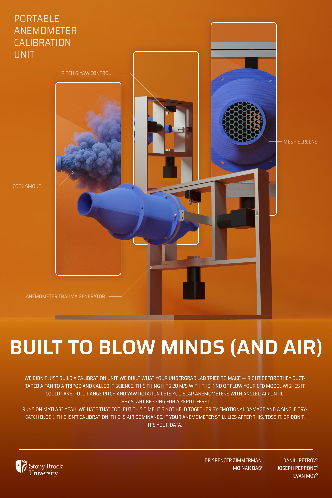
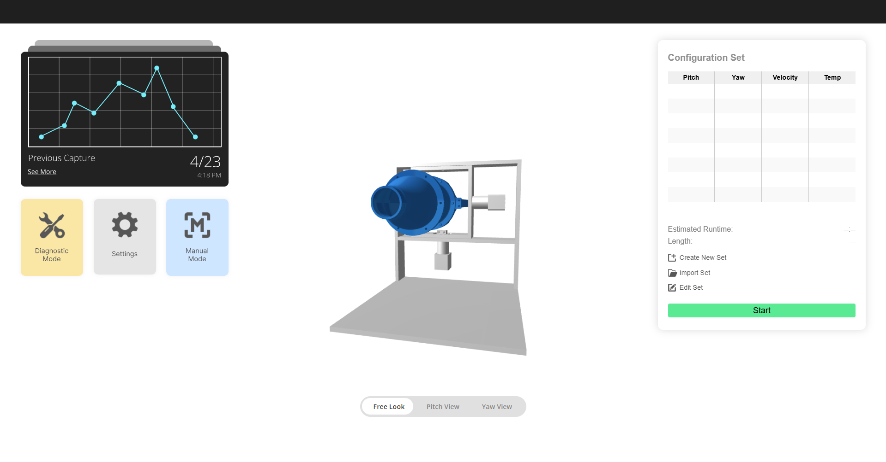
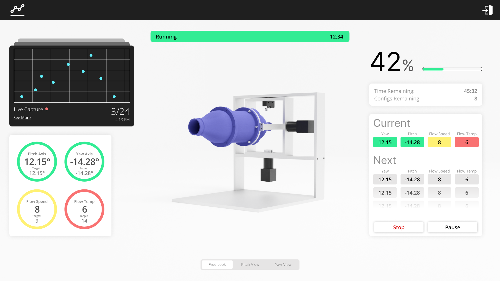
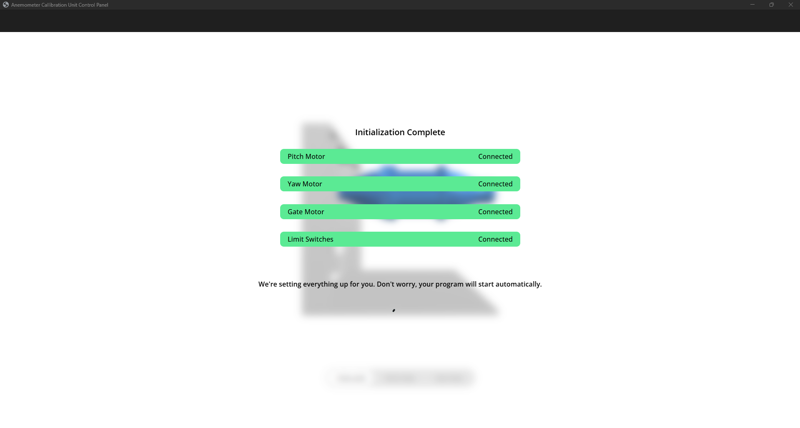
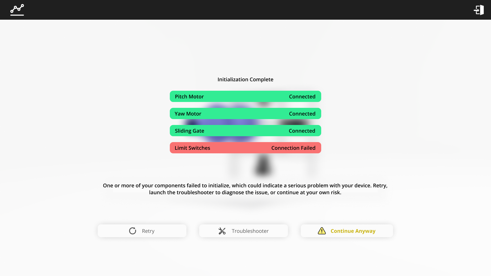

# Python App for Anemometer Calibration Unit Controller



This repository serves as the GUI for the MATLAB-based Anemometer Calibration Unit Controller, found [here](https://github.com/moinakdas/Anemometer-Calibration-Unit-Controller). If you ONLY want command-line functionality through MATLAB, use [this](https://github.com/moinakdas/Anemometer-Calibration-Unit-Controller) link.

This library serves as the controller application for the Anemometer Calibration Unit developed under Dr. Spencer Zimmerman at Stony Brook University. The unit is designed to direct airflow via a nozzle at a specified pitch angle, yaw angle, and airflow rate, controllable via the GUI. It is designed to work with genuine Phidgets™ stepper motors/controllers, Phidgets™ digital interface, and a DT9834-BNC Data Acquisition Unit.

## Purpose
Hot-wire and cold-wire Anemometers are utilized to obtain accurate readings of fluid flow speed and fluid flow angle. The Anemometer Calibration Unit is designed to test these anemometers by subjecting them to a specified fluid flow speed and fluid flow angle. By comparing the parameters produced by the calibration unit to the parameters recorded by the anemometer, it is possible to determine the accuracy of the anemometer (i.e do the anemometer readings match the given conditions?)

## Prerequisites

1. Ensure that the correct version of MATLAB is installed on your system. As of May 2025, this code runs on MATLAB 2023b (64-bit Windows 11).

2. Install the **MATLAB Support for MiniGW-w64 C/C++ Compiler** from the Add-On Explorer page.

3. Install the **MATLAB Data Acquisition Toolbox** from the Add-On Explorer page.

4. Install the **Data Acquisition Toolbox Support Package for National Instruments** from the Add-On Explorer page.
   
5. Download the **DT-Open Layers for .NET** from Digilent, available [here](https://digilent.com/reference/software/openlayers/start)

6. Download the **Data Translation DAQ Adaptor for MATLAB®** from Digilent, available [here](https://digilent.com/reference/software/start):
  
    This will download a .mltb file, which you need to install using the MATLAB Add-On manager.
   
    After installation, this may be listed as *Data Acquisition Toolbox Support Package for Data Translation Hardware* by Digilent.
   
7. Navigate to ```C:\Users\{username}\AppData\Roaming\MathWorks\MATLAB Add-Ons\Toolboxes\Data Acquisition Toolbox Support Package for Data Translation Hardware\+daq\+dt\+internal'```

   In ```AsyncOLChannel.m``` modify the following lines:

   ```
   Line 1:  classdef AsyncOLChannel < matlabshared.asyncio.internal.Channel
   ```
   ```
   Line 21:  obj@matlabshared.asyncio.internal.Channel(pluginInfo.devicePath, ...
   ```
   ```
   Line 23:  'Options', channelOptions,...
   ```
   ```
   Line 24:  'StreamLimits', streamLimits);
   ```
   ```
   Line 35:  matlabshared.asyncio.internal.DataEventInfo(remainderIn) );
   ```
   ```
   Line 51:  matlabshared.asyncio.internal.DataEventInfo(remainderOut) );
   ```

   In ```ChannelGroupOL.m``` modify the following line:

   ```
   Line 23:  AsynchronousIoChannel = matlabshared.asyncio.internal.Channel.empty();
   ```
   
8. Install python eel
   
   ```bash
   pip install eel
   ```

## Installation

To install and run this repository locally:

```bash
# Clone the repository
git clone https://github.com/moinakdas/python-anemometer-calibration-unit-controller.git
cd anemometer-calibration-unit
```

Then, launch main.py

## Pre-Operation
Ensure
- The DT9834-BNC DAQ is turned on and operational
- The pitot tube is positioned at the end of the nozzle
- The plenum chamber is plugged in, with both the fan and power switch at the ON position
- The controlling laptop is plugged into the plenum chamber via the included usb c cable

## Operation
The following describes the workflow of the main MATLAB script.

### 1. Initialization
All required motor and DAQ handles are created using `init_wrapper.m`. Connections are verified and printed to the console.

### 2. Zeroing
Each motor is zeroed using limit switches via `zeroMotor_wrapper.m`. Zero positions are stored for reference during operation.

### 3. Configuration Execution
`runConfigurationSet.m` iterates over a matrix of [Yaw, Pitch, Velocity] configurations. You may change these configurations as desired. Motors move to specified orientations and airflow velocity is achieved using PID-controlled gate positioning.

### 4. Cleanup
All motors are disengaged and handles released using `cleanup_wrapper.m`, even in the case of failure. Note that ctrl-Cing out of a running process will not disengage the motors properly, and will result in unexpected operation. In this case, restart MATLAB and clear cache.

## Usage

Using the GUI, you may
- Create, import, and manage configuration sets (Sets of pitch angles, yaw angles, and airflow speeds you would like the unit to move through)
- View and manage previous captures
- Troubleshoot connection issues from the device
- View statuses of connections and internal device components

## Screenshots






# Future Work

- Implementation of airflow temperature control via PID control of Peltier Chips.
- Use a object-oriented approach for cleaner syntax
- Rewrite this in anything but MATLAB 


